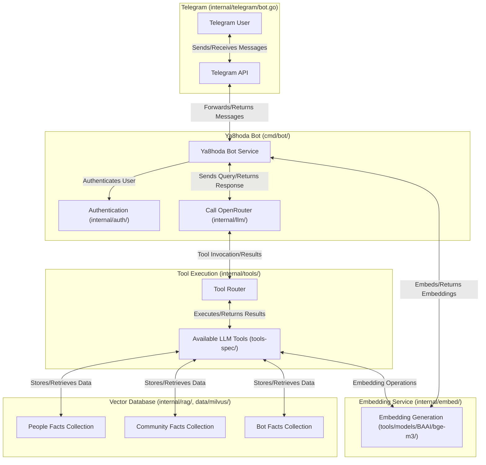

# Ya8hoda - Telegram RAG Bot

Ya8hoda is a Telegram bot with Retrieval-Augmented Generation (RAG) capabilities using Milvus as a vector database.

## Features

- Interact with users via Telegram
- Store and retrieve documents using vector similarity search
- Generate images using OpenRouter API
- Role-based access control for different user types

## Requirements

- Go 1.21 or higher
- Docker and Docker Compose for running Milvus

## Tech Stack

- [go-telegram/bot](https://github.com/go-telegram/bot) - Telegram Bot API Go framework
- [Milvus](https://milvus.io/) - Vector database for RAG capabilities
- [OpenRouter](https://openrouter.ai/) - API for LLM and image generation

## Architecture and Message Flow

This section provides a project manager's perspective on how a Telegram message is processed by the Ya8hoda bot, including interactions with the database and available tools.

### Message Processing Overview

The typical flow of a message through the system is as follows:

1.  **User Interaction (Telegram):** A user sends a message to the bot via the Telegram interface.
2.  **Message Reception (`internal/telegram`):** The Telegram Bot API forwards the message to the Ya8hoda bot, where the `internal/telegram` package handles its initial reception and parsing.
3.  **Authentication (`internal/auth`, Optional):** The system may perform authentication/authorization checks based on the user's Telegram ID to determine their permissions and access rights.
4.  **Core Processing (`internal/core`, `cmd/bot`):** The message is passed to the core application logic.
    *   **Embedding Generation (`internal/embed`):** If the message requires semantic understanding or RAG, its content is converted into a vector embedding using the BAAI/bge-m3 model (located in `tools/models/BAAI/bge-m3`).
    *   **Retrieval-Augmented Generation (RAG - `internal/rag`):**
        *   The generated embedding is used to query the Milvus vector database.
        *   The query targets specific collections to find relevant factual memories:
            *   `people_facts`: Stores memories about specific individuals.
            *   `community_facts`: Stores memories related to communities.
            *   `bot_facts`: Stores memories and information about the bot itself.
        *   Relevant documents/facts are retrieved from Milvus.
    *   **LLM Interaction (`internal/llm`):** The original message, along with any retrieved context from Milvus, is sent to a Large Language Model (LLM) via an external API (e.g., OpenRouter).
    *   **Tool Usage (Optional - `internal/tools` & `tools-spec`):**
        *   The LLM may decide to use one of the available tools to fulfill the user's request or gather more information.
        *   If a tool is invoked, the `internal/tools` package handles its execution. Tools might involve further interaction with Milvus (e.g., storing or retrieving a specific memory).
        *   The results from the tool are returned to the LLM.
    *   **Response Generation (`internal/llm`):** The LLM generates a final response based on the input, retrieved context, and any tool outputs.
5.  **Response Delivery (`internal/telegram`):** The generated response text is sent back to the user via the Telegram API.

### Visual Flow (Mermaid Diagram)



### Key Data Stores & Integrations

*   **Milvus Vector Database (`internal/rag/milvus_collections.go`):**
    *   `people_facts`: Contains vectorized memories and facts about individual users.
    *   `community_facts`: Stores information and memories pertaining to defined communities or groups.
    *   `bot_facts`: Holds facts and definitions about the bot itself, its capabilities, and persona.

*   **Available LLM Tools (`tools-spec/`):** The LLM can leverage the following tools to enhance its responses and capabilities:
    *   **`remember_about_community`**: "Let me search my memories about a specific community to answer your question."
    *   **`remember_about_person`**: "Retrieves stored factual memories about a specific person based on their Telegram ID or name. Use this to recall information previously stored about someone."
    *   **`remember_about_self`**: "I should use this if I need to remember anything at all related to myself."
    *   **`store_community_memory`**: "Got it, I'll remember this fact about the community you specified. I can bring it up later."
    *   **`store_person_memory`**: "Stores a single factual statement or memory about a specific person, identified by their Telegram ID and name."
    *   **`store_self_memory`**: "Okay, I'll store this fact about myself. This helps me learn and remember who I am. (Only admins can ask me to do this)."

## Configuration

Create a `.env` file in the project root with the following environment variables:

```
# Required settings
TG_BOT_TOKEN=your_telegram_bot_token
OPENROUTER_API_KEY=your_openrouter_api_key
OPENROUTER_MODEL=qwen/qwq-32b


# Optional settings
MILVUS_HOST=milvus
MILVUS_PORT=19530
LOG_LEVEL=info
ADMIN_USER_IDS=123456789,987654321
ALLOWED_USER_IDS=123456789,987654321
```

## Running the Bot

### Using Docker Compose (recommended)

```bash
docker-compose up -d
```

This will start the bot and Milvus server in containers.

### Running Locally

First, start the Milvus server:

```bash
docker-compose up -d milvus
```

Then run the bot:

```bash
go run cmd/main.go
```

## Development

The main bot code is in `cmd/bot/main.go`. The root `cmd/main.go` serves as a wrapper that can either run the bot directly or execute the compiled binary.

## License

MIT 